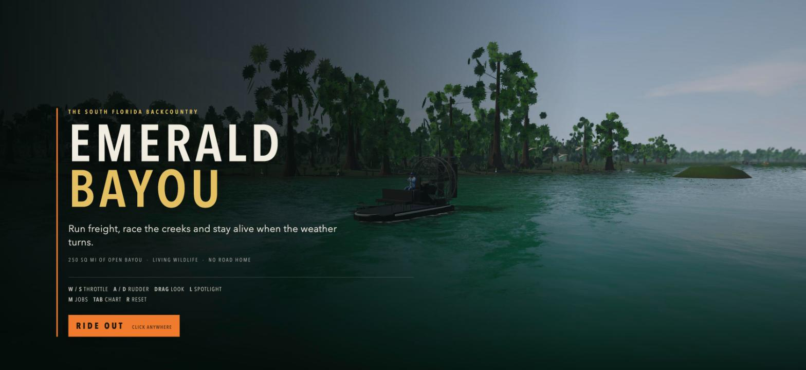
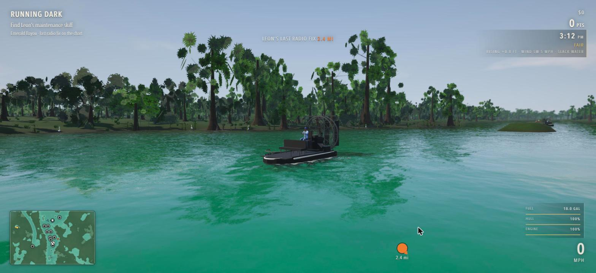
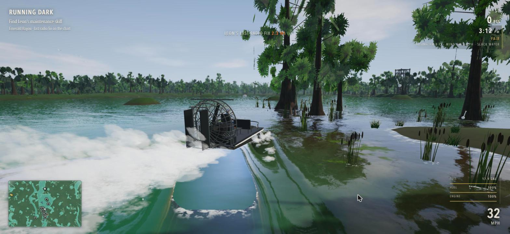
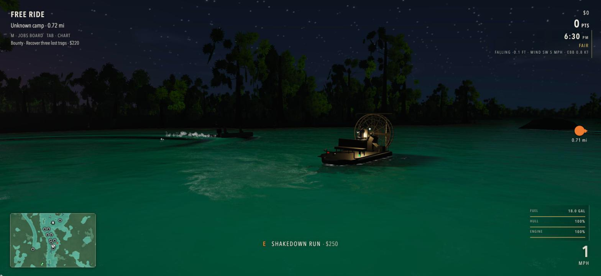
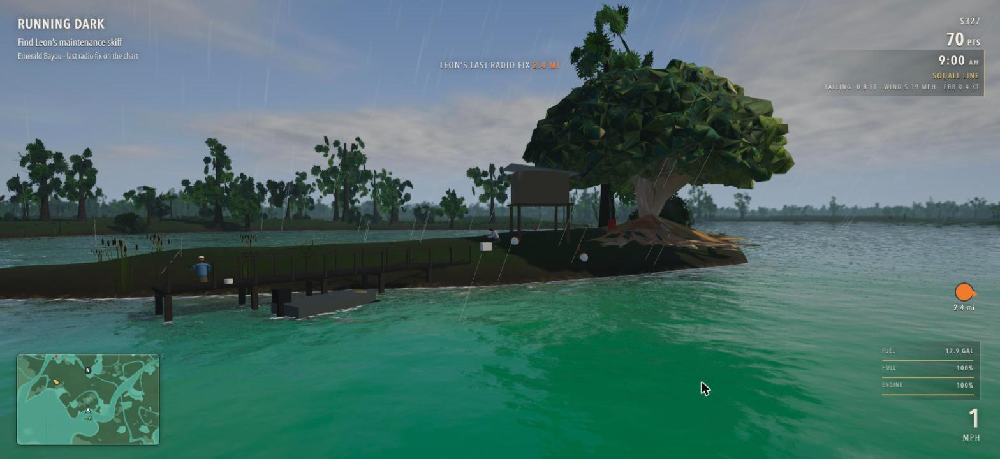
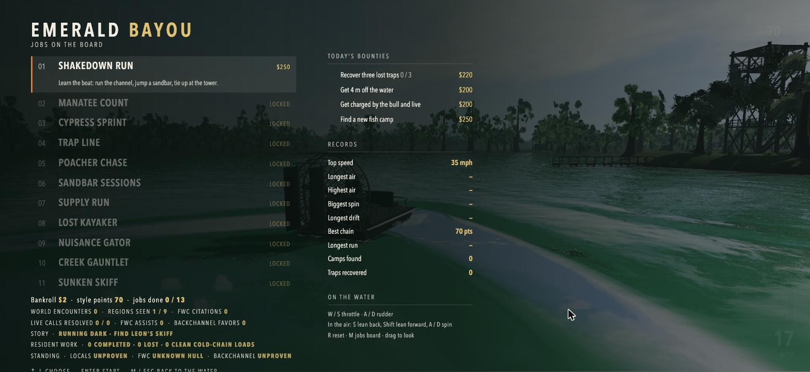
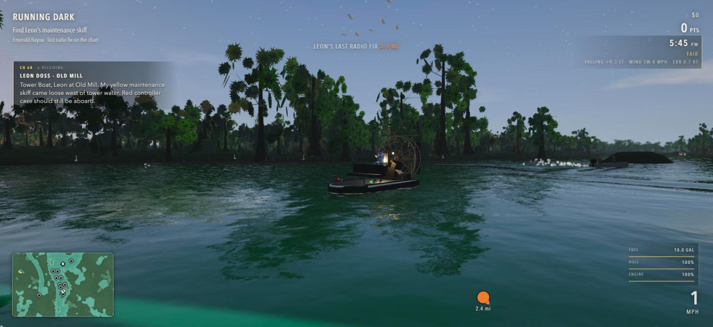
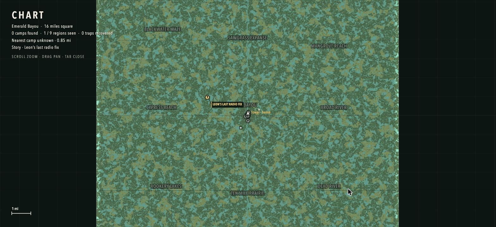

# Emerald Bayou

An airboat game set in the south Florida backcountry. Runs in a browser, built on three.js and Vite, with no game engine underneath it. You get a 16 mile square of streamed swamp, thirteen jobs, a radio that talks back, and weather that will ruin your afternoon.

[Play Emerald Bayou](https://vheissu.github.io/emerald-bayou/)

Everything you see is generated at runtime except a handful of GLB props. The terrain, the rivers, the sawgrass prairie, the cypress, the fish camps and the people standing on their docks are all seeded from world coordinates, so the map is the same every time you load it and none of it is stored on disk.

<table>
<tr>
<td width="50%"></td>
<td width="50%"></td>
</tr>
<tr>
<td></td>
<td></td>
</tr>
</table>

## Running it

```bash
git clone git@github.com:Vheissu/emerald-bayou.git
cd emerald-bayou
npm install
npm run dev
```

Then open http://127.0.0.1:5173. You want a machine with a real GPU. It targets 60 fps at dpr 2 and the cost is almost entirely fill rate, so if it drags, shrink the window before you touch anything else.

`npm run build` produces a static `dist/` you can drop on any host.

### Assets

The GLB models (boats, the driver, the alligator, grass clumps, three cypress variants) aren't in the repo. They're 150 MB and one of them is over GitHub's file size limit, so they ship as a release asset instead:

```bash
curl -L https://github.com/Vheissu/emerald-bayou/releases/latest/download/emerald-bayou-models.zip -o models.zip
unzip models.zip -d public/models
```

The game runs without them. `src/models.js` catches the failed loads and falls back to procedural stand-ins, so you get a playable but noticeably worse looking swamp.

The GitHub Pages workflow downloads and verifies this archive before it builds the public game.

## Controls

| Key | |
|---|---|
| `W` / `S` | throttle and reverse |
| `A` / `D` | rudder, and spin while airborne |
| `S` / `Shift` in the air | lean back, lean forward |
| drag | look around |
| `E` | interact (job posts, docks, traps) |
| `M` | jobs board |
| `Tab` | chart |
| `L` | spotlight |
| `R` | reset the boat |

## What's in it



Thirteen jobs unlock in sequence, from a shakedown run through a manatee count, a poacher chase against an AI skiff, a night rescue and a creek gauntlet. On top of that there are daily bounties, per-run records (top speed, longest air, biggest spin, longest drift), a reputation system split three ways between the locals, the FWC and the backchannel, and a story that comes in over channel 68.

Between jobs, you can come across dead motors, FWC stops, watched packages, storm wreckage, drifting fuel drums and illegal monofilament sets. A hard strike can split a drum and leave a sheen moving with the current. It can also stop one of the resident working boats: kill the prop and hold alongside while the crew checks everyone aboard, or leave and hear your hull reported over the radio.

The seven resident crews keep their own schedules, jobs and operator records. They run for shelter when the weather exceeds what their boat can carry, complain about wake over working gear and remember collisions. FWC 27 can break from patrol to answer an emergency tow call when there is a safe approach.

On clear, low-wind nights, dense fog can settle over the backcountry before dawn and burn off after sunrise. Visibility drops to a few hundred metres. Powerboats slow down, show their navigation lights and sound a prolonged blast while making way; every crew keeps its own signal clock.

The water is the part that took longest. Real reflection and refraction passes, a tannin absorption map rendered by the terrain workers so still shaded water goes black and grows duckweed, a tide that moves the shoreline about 0.4 m either way, and a wake that stamps into the surface and shoves floating debris around.

Wildlife lives its own life. Alligators bask on banks and slide in when you get close, and the bull will charge an idle hull inside 16 m. Mullet jump near the boat, bait boils off the bow in the shallows, ibis and pelicans run lines low over the water, and vultures circle high. When you get more than 700 m away it all quietly relocates ahead of you.

People are jointed figures driven by a pose target system rather than baked animation, so a man on a dock will track you as you go past, drink his beer, check his rod, cast, and reel in a fish. Boat ramps run a 150 second cycle where a truck backs down the slab, floats a boat off the trailer, motors out and comes back to winch it on.



## How the world works



`src/heightfield.js` is plain JavaScript with no three.js import, which lets the main thread and a pool of up to four web workers evaluate the same terrain function. The home bayou around the tower is hand shaped inside a 560 m radius, blending out to procedural noise by 780 m. Past that, domain warped ridged noise carves rivers and creeks, fbm makes lakes, and flat sawgrass prairie fills the gaps with tree hammocks scattered through it. Sandbars are seeded per 400 m cell.

`src/terrain.js` streams that as a quadtree, six levels from 100 m chunks up to 3200 m, 64 segments each, out to 7.2 km. Skirts hide the LOD cracks and a coarse parent stays visible until all four of its children have finished building, so you never see a hole. Vegetation is built per chunk as instanced meshes with tiers by level, dropping grass and cypress knees first and ending at crossed cards for far trees. Tree positions are seeded per 100 m cell and accepted at the exact terrain height, which is what makes every LOD agree with every other one.

The two lessons that cost the most time: per chunk bounding spheres are not optional (leaving `frustumCulled = false` on a thousand instanced meshes dropped the frame rate to 19), and the coarse fallback has to be local, because letting a root tile draw whenever any distant leaf is still building puts a 3200 m blob over your boat.

Minimap tiles are 200 m and rendered by the same workers, then cached. The chart is the same idea at 3200 m with chart styling.

## Layout

```
src/
  heightfield.js   terrain function, no three.js, shared with the workers
  terrain.js       quadtree streaming and LOD
  vegetation.js    per-chunk instancing, wind shader
  water.js         reflection, refraction, murk, tide
  airboat.js       hull physics, air control, landing quality
  game.js          jobs, bounties, records, save
  story.js         the channel 68 arc
  folk.js          jointed people and the pose target animation
  life.js          fish, debris, NPC traffic, bank anglers
  sites.js         stilt houses, ramps, boathouses, duck blinds
  world.js         seeded camps, traps, camp runs
  hud.js           HUD and radar
  worldmap.js      the chart
```

## Dev hooks

`window.__dbg` is exposed in the browser console with the renderer, camera, terrain, physics, water and most of the game systems on it.

```js
__dbg.mode = 'depth'                      // full | raw | nowater | depth | refl
__dbg.phys.reset(x, z, heading)           // teleport
__dbg.environment.minutesPerSecond = 0    // freeze the clock
__dbg.environment.setHour(17.4)           // pick the light
__dbg.freeCam = { x, y, z, tx, ty, tz }   // park the camera
__dbg.terrain.hf.computeBase(x, z)        // { h, s, lake, prairie, hammock }
```

`import('/src/inspect.js')` from the console gives you a helper for measuring and previewing a GLB, which is how the entries in `SPEC` in `src/models.js` were worked out.

## Licence

MIT. See [LICENSE](LICENSE).

The GLB models in the release archive were generated with [Meshy](https://www.meshy.ai/) and are covered by their own terms, not by this repository's licence.
